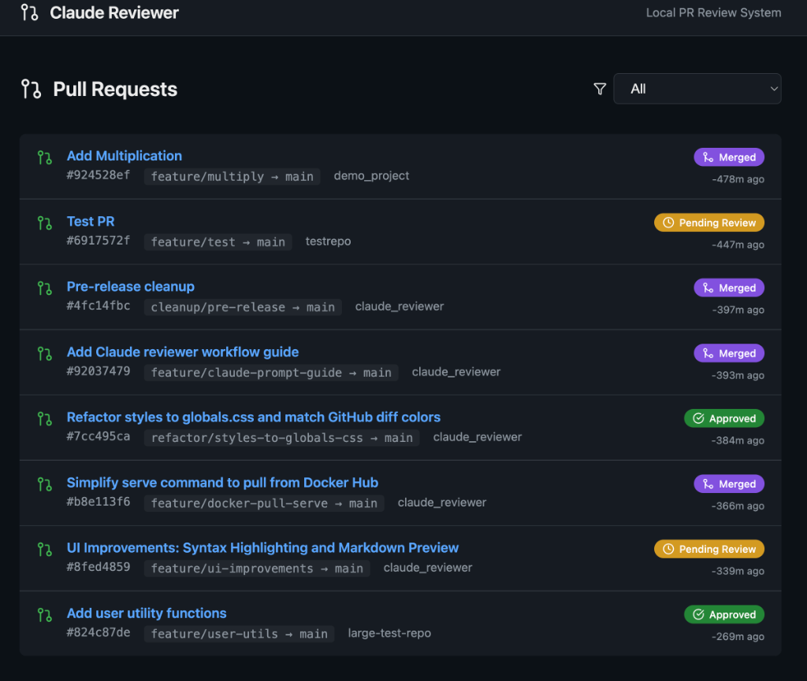
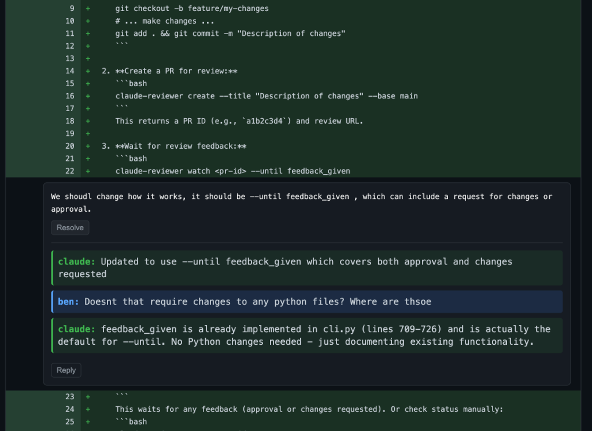

# Claude Reviewer

[](https://badge.fury.io/py/claude-reviewer)
[](https://hub.docker.com/r/bowles/claude-reviewer)
[](https://www.python.org/downloads/)
[](https://opensource.org/licenses/MIT)

**Links:** [GitHub Repository](https://github.com/bowlesb/claude-reviewer) | [PyPI Package](https://pypi.org/project/claude-reviewer/) | [Docker Hub Image](https://hub.docker.com/r/bowles/claude-reviewer)

A local PR review system designed for AI-assisted development with Claude Code. Create pull requests, review diffs with inline comments, and manage code reviews—all without leaving your local environment or pushing to GitHub.

## Why Claude Reviewer?

When working with Claude Code on complex changes, you need a way to:

- **Review AI-generated code** before merging into your main branch
- **Leave inline comments** on specific lines for Claude to address
- **Track review status** across multiple iterations
- **Maintain a clean git history** with proper PR workflow

Claude Reviewer bridges the gap between local development and GitHub-style code review.

## Installation

### CLI (Required)

```bash
pip install claude-reviewer
```

### Web UI (Optional)

The web UI runs via Docker (recommended) or locally with Node.js.

#### Option A: Docker (Easiest)
```bash
claude-reviewer serve
```

#### Option B: Local Node.js (No Docker)
Requires `npm` and the source code.

```bash
# Clone the repo if you haven't already
git clone https://github.com/bowlesb/claude-reviewer.git
cd claude-reviewer

# Run with local flag
claude-reviewer serve --local
```

## Quick Start

### 1. Create a PR

From your project directory, on a feature branch:

```bash
claude-reviewer create --title "Add authentication system"

# Output:
# PR #a1b2c3d4 created successfully
# Review URL: http://localhost:3000/prs/a1b2c3d4
```

### 2. Review in the Web UI

Open the review URL to:
- View the diff with syntax highlighting
- Add inline comments on any line
- Approve or request changes

### 3. Address Feedback

When you (or Claude) need to address review comments:

```bash
# Check comments
claude-reviewer comments a1b2c3d4

# Output:
# [src/auth.py:42] Add error handling for invalid tokens
# [src/auth.py:87] Consider using a constant for the expiry time

# After making fixes
git commit -m "Address review feedback"
claude-reviewer update a1b2c3d4
```

### 4. Merge When Approved

Once the PR is approved:

```bash
# Check status
claude-reviewer status a1b2c3d4
# Output: approved

# Merge the PR
claude-reviewer merge a1b2c3d4
```

## Architecture

```
                    ┌─────────────────┐
                    │   Web Browser   │
                    │  localhost:3000 │
                    └────────┬────────┘
                             │
         ┌───────────────────┼───────────────────┐
         │                   │                   │
         v                   v                   v
┌─────────────────┐  ┌──────────────┐  ┌─────────────────┐
│  claude-reviewer │  │   Next.js    │  │   Claude Code   │
│      CLI        │  │   Web App    │  │   (via CLI)     │
└────────┬────────┘  └──────┬───────┘  └────────┬────────┘
         │                  │                   │
         └──────────────────┼───────────────────┘
                            │
                   ┌────────▼────────┐
                   │     SQLite      │
                   │   ~/.claude-    │
                   │ reviewer/data.db│
                   └─────────────────┘
```

## CLI Reference

| Command | Description |
|---------|-------------|
| `claude-reviewer create -t "Title"` | Create a new PR for the current branch |
| `claude-reviewer list` | List all PRs |
| `claude-reviewer status <id>` | Check PR status (pending/approved/changes_requested) |
| `claude-reviewer comments <id>` | Get inline comments with file:line references |
| `claude-reviewer show <id>` | Show detailed PR information |
| `claude-reviewer update <id>` | Update PR diff after making changes |
| `claude-reviewer merge <id>` | Merge an approved PR |
| `claude-reviewer serve` | Start the web UI (Docker) |
| `claude-reviewer serve --local` | Start the web UI locally (npm) |
| `claude-reviewer stop` | Stop the web UI |

### Common Options

```bash
# Create with custom base branch
claude-reviewer create -t "Feature" --base develop

# Get comments as JSON (useful for automation)
claude-reviewer comments a1b2c3d4 --format json

# Filter PR list by status
claude-reviewer list --status pending

# Merge without pushing to remote
claude-reviewer merge a1b2c3d4 --no-push

# Merge and delete source branch
claude-reviewer merge a1b2c3d4 --delete-branch
```

## Web UI Features

### PR Dashboard
View all PRs with status indicators, filtering, and quick actions.



### Diff Viewer & Reviews
GitHub-style diff viewer with syntax highlighting and inline commenting.



- **PR Dashboard** - View all PRs with status indicators
- **GitHub-style Diff Viewer** - Syntax highlighted, unified diff view
- **Inline Comments** - Click any line number to add a comment
- **File Navigation** - Jump between changed files via sidebar
- **Review Actions** - Approve or request changes with optional summary
- **Comment Resolution** - Mark comments as resolved/unresolved

## Configuration

### Environment Variables

| Variable | Description | Default |
|----------|-------------|---------|
| `DATABASE_DIR` | Directory for SQLite database | `~/.claude-reviewer` |
| `CLAUDE_REVIEWER_HOST` | Host for review URLs | `localhost` |
| `CLAUDE_REVIEWER_WEB_DIR` | Path to web UI directory | (auto-detected) |

### Docker Volumes

The web UI mounts these volumes:

```yaml
volumes:
  - ~/.claude-reviewer:/data:rw     # Database
  - ~/:/host-home:rw                # Repository access
```

## Workflow with Claude Code

Claude Reviewer is designed to work seamlessly with Claude Code:

1. **You make a request** to Claude for a code change
2. **Claude creates a branch** and implements the change
3. **Claude creates a PR** using `claude-reviewer create`
4. **You review** in the web UI and add comments
5. **Claude checks comments** with `claude-reviewer comments`
6. **Claude addresses feedback** and runs `claude-reviewer update`
7. **You approve** when satisfied
8. **Claude merges** with `claude-reviewer merge`

This keeps you in control while leveraging Claude's capabilities.

## Development

### Prerequisites

- Python 3.9+
- Node.js 20+
- Docker (for web UI)

### Local Development

```bash
# Clone the repository
git clone https://github.com/bowlesb/claude-reviewer.git
cd claude-reviewer

# Install CLI in development mode
cd claude-reviewer-cli
pip install -e ".[dev]"

# Run CLI tests
make test

# Start web UI in development mode
cd ..
npm install
npm run dev
```

### Project Structure

```
claude-reviewer/
├── claude-reviewer-cli/      # Python CLI package
│   ├── claude_reviewer/
│   │   ├── cli.py           # CLI commands (Click)
│   │   ├── database.py      # SQLite operations
│   │   ├── git_ops.py       # Git operations (GitPython)
│   │   └── models.py        # Data models
│   └── pyproject.toml
├── app/                      # Next.js app router
│   ├── page.tsx             # PR list dashboard
│   ├── prs/[id]/page.tsx    # PR review page
│   └── api/                 # API routes
├── lib/
│   └── database.ts          # TypeScript DB layer
├── Dockerfile
└── docker-compose.yml
```

## Troubleshooting

### "Not a git repository" error

Run `claude-reviewer` commands from within a git repository.

### Web UI shows "docker-compose.yml not found"

```bash
# Option 1: Run from the claude-reviewer directory
cd /path/to/claude-reviewer
claude-reviewer serve

# Option 2: Specify the path
claude-reviewer serve --dir /path/to/claude-reviewer

# Option 3: Set environment variable
export CLAUDE_REVIEWER_WEB_DIR=/path/to/claude-reviewer
```

### Port 3000 already in use

```bash
# Check what's using the port
lsof -i :3000

# Use a different port
claude-reviewer serve --port 3001
```

### Database locked errors

The SQLite database uses WAL mode for concurrent access. If you see lock errors:

```bash
# Check for stale processes
ps aux | grep claude-reviewer

# Reset the database (warning: deletes all data)
rm ~/.claude-reviewer/data.db
```

### Docker "authorization failed" or "repository does not exist"

If you see these errors when running `serve`:
1.  Ensure you have Docker installed and running.
2.  The image `bowlesb/claude-reviewer` is public, but if you have issues, try logging out:
    ```bash
    docker logout
    ```
3.  If you are trying to push/build custom images, ensure you are logged in:
    ```bash
    docker login
    ```

## Contributing

Contributions are welcome! Please feel free to submit a Pull Request.

## License

MIT License - see [LICENSE](LICENSE) for details.
